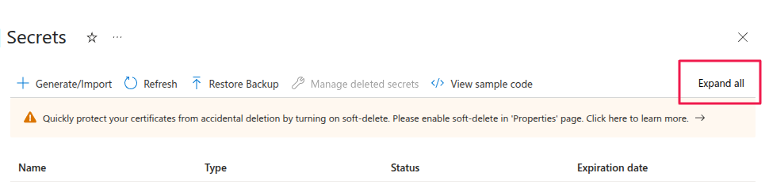

# 🔐 Azure Vault Secrets Helper

A lightweight browser extension that enhances the Azure Portal experience by adding an **"Expand all"** button to Azure Key Vault secrets pages.

## ✨ Features

- Adds an `"Expand all"` button on Azure Key Vault secrets list
- Helps you quickly view all secret values without expanding each one manually
- Works seamlessly inside Azure Portal without any setup

## 🖥️ How it works

The extension:

1. Injects an **"Expand all"** button into the Azure Portal UI
2. On click, it:
    - Scrolls the secrets list and loads all paginated entries
    - Expands each secret in the list so you can view all values at once

This helps you avoid repetitive clicking when reviewing or copying secrets.

## 🔒 Privacy

This extension **does not collect any data** and runs entirely in your browser.  
It only modifies the page locally to improve usability inside the Azure Portal.
